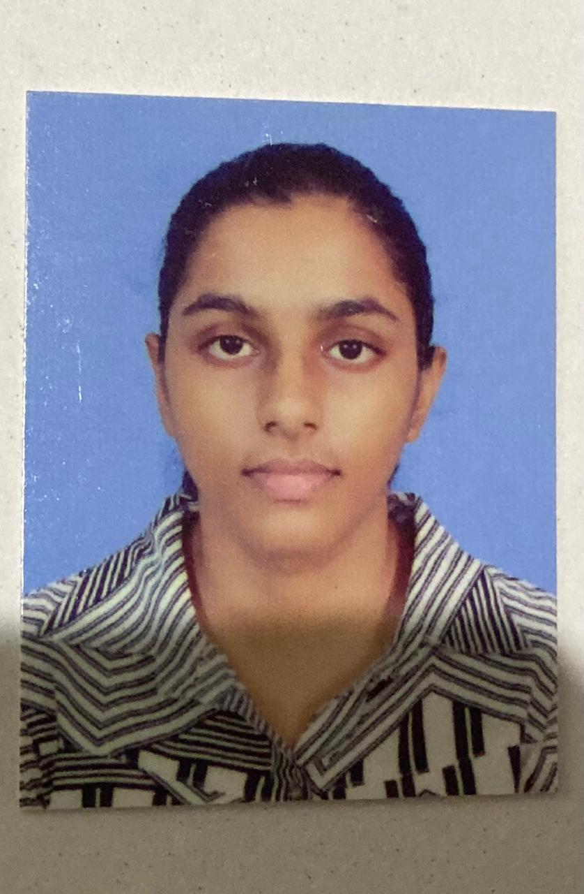

---
layout: default
title: "Home"
---

# 👩‍🔬 Thyagi Parindya
Biotechnology Student | Aspiring creative thinker | Innovator

{:style="border-radius:50%;max-width:150px;"}

---

## 🌟 About Me
 I'm Thyagi Parindya, a driven and enthusiastic biotechnology student with a passion for genetic engineering, molecular biology, microbiology, biopharmaceuticals, and plant tissue culture. I'm excited to apply my knowledge and skills to contribute to innovative solutions in the biotechnology industry. I'm a proactive individual who thrives on facing challenges and finding groundbreaking solutions.

---

## 🎓 Education  

### Secondary Education – Good Shepherd Convent, Colombo 13  

*GCE O/L (2020) – 9 A's*  

| Subject            | Grade |
|--------------------|-------|
| Sinhala            | A     |
| Science            | A     |
| Mathematics        | A     |
| Biology            | A     |
| English            | A     |
| English Literature | A     |
| Sri Lankan History | A     |
| Civic Education    | A     |
| Religion           | A     |

*GCE A/L (2023) – 3C's*  

| Subject   | Grade |
|-----------|-------|
| Biology   | C     |
| Chemistry | C     |
| Physics   | C     |
| General English | A |

*Higher Education*  
Currently pursuing *BSc (Hons) in Biotechnology* at SLIIT University, Malabe.  

---
## Working Experiences
Although I don't have formal work experience yet, I'm eager to apply my skills and knowledge in a professional setting.
---
## Other Professional Qualifications
Certificate in Level 8 Spoken English from Wendy Whatmore Academy, enhancing my communication skills.
---

## 🧪 Projects  
-SciFest 2025: Active member of the project team at SLIIT Malabe, where we mentored young school students in developing innovative biotech concepts and provided support to coordinate the event.
- Roots of Tomorrow: Participated in a volunteer service project, planting 50 Mee trees, contributing to environmental sustainability.
  

---
##hobbies
-Reading scientific articles, books, eBooks, and literature on biotechnology and related fields.
- Participating in research seminars and workshops.
- Volunteering for science outreach and education initiatives.
- Applying practical knowledge to develop cutting-edge biotechnology innovations.
- Gardening.
- Collecting inspiring motivational quotes.
---

## 🛠 Other Skills   
- Proficient in laboratory techniques, including microscopic observations, handling glassware, and DNA extraction.
- Familiarity with bioinformatics tools and databases.
- Strong analytical and problem-solving skills.
- Excellent communication skills.
- Proven team spirit and leadership with responsibility.
---
## 📜 Download My Resume  
[➡ Resume (PDF)](HS25519276 resume.pdf)  

---

## 📬 Contact  

- 📧 Email: [hs25510276@my.sliit.lk](mailto:hs25510276@my.sliit.lk)  

---

© 2025 Thyagi Parindya | Biotechnology Portfolio

